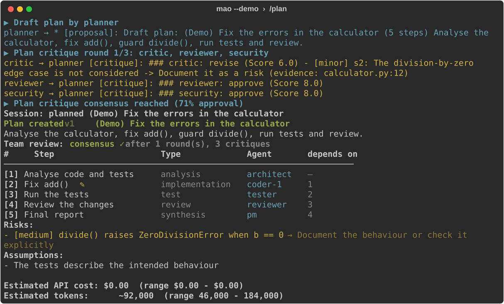

# Multi AI Orchestrator (`mao`)

**A team of AI agents that works on your codebase — in the terminal.**

[](https://github.com/6fbm/MAO/actions/workflows/ci.yml)
[](https://www.python.org/)
[](LICENSE)


Several cloud and local models (OpenAI, Google Gemini, xAI Grok, Anthropic Claude, Ollama, llama.cpp,
LM Studio, OpenRouter …) work as a **team of agents** with fixed roles on one task: they analyse a
project folder, research, discuss solutions, criticise each other, implement changes, run tests and
verify the result — coordinated by an orchestrator.

Every operation you see is a real model or tool call. Only the explicitly marked `--demo` mode
simulates the model replies — tools, files and tests are real even there.



## Features

- **PLAN mode**: triage → parallel investigations → draft plan → critique rounds with consensus check
  → judge decision → plan with risks, agent assignment, token and cost estimate. No changes to the workspace.
- **RUN mode**: executes the task graph with parallelism, test→debug→fix cycles, review→fix cycles,
  debates on decisions, final report.
- **Any number of agents**, including several instances of the same model (`/agents add 5x gpt coder`).
- **Agent-to-agent communication**: messages, a shared blackboard with sources, targeted context
  hand-off, follow-up questions (`consult_agent`).
- **Debate & consensus**: proposals, critique backed by evidence, revision, weighted voting, and a
  judge that checks the evidence itself.
- **Several API keys per provider** with rotation on rate limits and errors, retries, timeouts, fallback models.
- **Security**: workspace sandbox, per-agent permissions, approval dialogs for risky actions, encrypted
  API keys (Windows DPAPI), secrets are never logged.
- **Token and cost control**: usage per agent/provider/model, context utilisation, budgets
  (`/max-tokens`, `/max-cost` …).
- **Sessions**: everything is stored and resumable; detailed logs; backups and rollback for every file
  change; git checkpoints.
- **Live dashboard** in the terminal with keyboard control.

## Requirements

- Linux, macOS, or Windows 10/11 (CMD or Windows Terminal)
- Python ≥ 3.11, optionally [uv](https://docs.astral.sh/uv/)
- Optional: git, [Ollama](https://ollama.com/) for local models, API keys for the providers you want

## Installation

Clone the repository (`git clone https://github.com/6fbm/MAO.git`), then one command does everything - it sets the environment up on the first run
and starts the program on every run after that:

**Linux / macOS**

```bash
cd MAO
./start.sh
```

**Windows**

```bat
cd MAO
start.bat
```

Arguments are passed straight through, so `./start.sh doctor` works as well.

If you would rather keep the two steps apart: `./install.sh` (`install.cmd`) creates `.venv`, installs
the package and generates the configuration files in `config/`; `./mao.sh` (`mao.cmd`) starts the
program. Manual install:

```bash
python -m venv .venv
.venv/bin/python -m pip install -e ".[dev]"     # Windows: .venv\Scripts\python.exe
.venv/bin/python -m mao init
```

## Quick start

```text
./start.sh
mao › /workspace ~/projects/my-project
mao › /providers key add openai          (the key is prompted hidden and stored encrypted)
mao › /plan Analyse my project and find out how we can improve performance.
      … live view of the agents …
Run the plan? [y] yes / [n] discard / [e] edit / [L] later (/run)
mao › /run
```

Alternatively, provide API keys as environment variables — the names are listed in
`config/providers.yaml`, e.g. `OPENAI_API_KEY`, `OPENAI_API_KEY_2`, `GEMINI_API_KEY`, `XAI_API_KEY`,
`ANTHROPIC_API_KEY`.

### Offline demo without API keys

```bash
./start.sh demo-workspace demo-project
./start.sh --demo --workspace demo-project
mao › /plan Fix all errors in the calculator
```

The model replies are simulated; the agents still really read and change files, the tests really run,
and all logs and sessions are created exactly as in normal operation.

### Single commands without the interactive shell

```bash
./start.sh plan "Fix the failing tests" --workspace ~/projects/x
./start.sh run                    # execute/resume the last session
./start.sh -c "/sessions" -c "/logs errors --tail 50"
./start.sh doctor                 # check environment, configuration and providers
```

## Commands

| Area | Commands |
|---|---|
| Tasks | `/plan <task>` · `/plan show` · `/replan <feedback>` · `/run [session]` (`/go`) · `/pause` · `/resume` · `/stop` · `/debate <question>` |
| Agents | `/agents` · `/agents add [Nx] <model> <role> [--name N]` · `/agents remove <name>` · `/agents show <name>` · `/agents set <name> <field> <value>` · `/agents roles` |
| Models | `/providers` · `/providers test [name]` · `/providers key add\|list\|remove <provider>` · `/providers enable\|disable <name>` · `/models [provider]` · `/models discover [provider]` · `/models info <ref>` |
| Usage | `/tokens` · `/cost` · `/max-tokens <n\|none>` · `/max-cost <usd\|none>` · `/max-agents <n>` · `/max-rounds <n>` · `/max-parallel <n>` |
| Sessions | `/sessions` · `/sessions load <id>` · `/sessions show <id>` · `/logs [file] [--tail N]` · `/messages [n]` · `/board [kind] [search]` · `/decisions` |
| Workspace & git | `/workspace [path]` · `/changes` · `/diff [path]` · `/rollback [path …]` · `/git status\|diff\|log\|commit <msg>\|checkpoints` |
| Configuration | `/config` · `/config show <section>` · `/config set <section.path> <value>` · `/config validate` · `/config reload` |
| General | `/help [command]` · `/status` · `/debug on\|off` · `/doctor` · `/clear` · `/exit` |

Text without a leading `/` is planned as a new task.

### Live view

During planning and execution the dashboard shows the phase, the active agents and what they are doing,
task-graph progress, tokens (input/output/total), cost against the limit, context utilisation and an
event feed (agent messages, tool calls, retries/fallbacks, approvals, decisions).

| Key | Effect |
|---|---|
| `P` or `Ctrl+C` | pause (running model calls finish, no new ones start) — then `/status`, `/tokens`, `/messages`, `/resume`, `/stop` |
| `S` | stop in a controlled way (resumable with `/run`) |
| `D` | debug view (model calls, tool results, message contents) |
| `M` | switch between events and agent communication |
| `Ctrl+C` twice quickly | abort the program |

## Agents

Default team (`config/agents.yaml`): planner, architect, researcher, coder ×2, reviewer, tester,
debugger, security, critic, pm — each with `model: auto`. Built-in roles: planner, architect,
researcher, coder, reviewer, tester, debugger, security, critic, documentation, project_manager,
performance.

```text
/agents add gpt architect
/agents add 3x gemini coder
/agents add ollama/qwen3:4b tester --name local-tester
/agents set coder permissions.terminal false
```

Your own agent in YAML:

```yaml
- name: security-expert
  role: security
  model: openai
  system_prompt: |
    You are a senior security engineer.
    Check every change for security problems.
  permissions:
    filesystem: read
    internet: true
    terminal: false
```

Model references: `auto`, `openai` (the provider's default model), `openai/gpt-5.6-terra`, or the
aliases `gpt`, `gemini`, `grok`, `claude`, `kimi`, `glm`, `local`. Setting
`settings.orchestration.auto_model_selection: false` turns every automatic choice off.

## Providers and models

| Provider | API | Keys |
|---|---|---|
| OpenAI | Responses API | `OPENAI_API_KEY`, `_2`, `_3` or secret store |
| xAI Grok | Responses API | `XAI_API_KEY` |
| Anthropic Claude | Messages API | `ANTHROPIC_API_KEY` |
| Google Gemini | generateContent | `GEMINI_API_KEY` / `GOOGLE_API_KEY` |
| DeepSeek | OpenAI-compatible | `DEEPSEEK_API_KEY` |
| Qwen (Alibaba Model Studio) | OpenAI-compatible | `DASHSCOPE_API_KEY` |
| Kimi (Moonshot AI) | OpenAI-compatible | `MOONSHOT_API_KEY` |
| Mistral AI | OpenAI-compatible | `MISTRAL_API_KEY` |
| GLM (Z.ai) | OpenAI-compatible | `ZAI_API_KEY` |
| Groq, Together AI | OpenAI-compatible | `GROQ_API_KEY`, `TOGETHER_API_KEY` |
| Ollama | `/api/chat` (local) | – |
| llama.cpp, LM Studio, vLLM, OpenRouter … | OpenAI-compatible | depends on the service |

Meta retired its own Llama API on 2026-07-06. Llama models are reached through a host such as Groq,
Together AI or OpenRouter, or run locally through Ollama or llama.cpp.

Model IDs and prices live in `config/providers.yaml` (as of 2026-09-14) and can be changed at any time.
`/models discover <provider>` reads the actually available models from the provider API. Local Ollama
models are detected automatically at start (tool capability and context length via `/api/show`); models
without native tool calling automatically use a text-based tool protocol.

## Security (short version)

- Agents only work inside the workspace; paths are resolved and checked including symlinks and junctions.
- Permissions per agent: `read`, `write`, `delete`, `execute`, `internet`, `git`; a global ceiling is possible.
- In PLAN mode every writing action is technically blocked.
- Risky actions (delete, move, risky commands, destructive git commands, sensitive files such as `.env`)
  require approval: `Allow? [y]es / [N]o / [a]lways`.
- Terminal processes never receive API keys or tokens in their environment; a timeout kills the whole
  process tree.
- API keys: encrypted with DPAPI on Windows, or from environment variables; always redacted in logs and
  transcripts. On Linux and macOS the store is a file with owner-only permissions (`0600`) — there is no
  DPAPI equivalent, so environment variables are the stronger option there.
- Original files are backed up before changes (`/rollback`); in git repositories a checkpoint is created
  as well.

Details: [docs/SECURITY.md](docs/SECURITY.md)

## Tokens, cost, limits

`/tokens` shows usage per agent/provider/model including cached and reasoning tokens and context
utilisation, `/cost` shows the cost against the budget. When a limit is reached you are asked whether to
raise it by 50 % or stop in a controlled way — or, with `on_limit: stop`, it stops immediately. Costs are
estimates from the price list unless a provider reports the real cost (e.g. OpenRouter).

## Sessions and logs

Every task is one session in `logs/session_<date>_<time>_<id>/`:

```text
session.json  plan.json  result.json  tokens.json  decisions.json  changes.json
messages.jsonl  events.jsonl  blackboard.json  backups/
orchestration.log  agents.log  tools.log  errors.log
```

`/sessions` lists them, `/sessions load <id>` plus `/run` resumes an interrupted session.

## Configuration

`config/settings.yaml`, `providers.yaml`, `agents.yaml`, `roles.yaml`, `tools.yaml`, `permissions.yaml` —
all commented and strictly validated (typos are reported). They are generated on first start from
[`src/mao/config/templates/`](src/mao/config/templates), which is the versioned source; your local
`config/` is yours and is not tracked by git. Details: [docs/CONFIGURATION.md](docs/CONFIGURATION.md)

## Tests

```bash
.venv/bin/python -m pytest
```

Unit tests (provider wire formats, gateway resilience, security, tools, agent runtime) plus integration
tests of the complete PLAN→RUN pipeline, the CLI and the live dashboard. The suite runs offline and
needs no API keys. Tests against a real local model: `pytest -m ollama` (requires a running Ollama with
a tool-capable model).

## Further documentation

- [docs/ARCHITECTURE.md](docs/ARCHITECTURE.md) — architecture, flows, extension points
- [docs/CONFIGURATION.md](docs/CONFIGURATION.md) — all configuration files
- [docs/SECURITY.md](docs/SECURITY.md) — security model and how to report a vulnerability
- [docs/LIMITATIONS.md](docs/LIMITATIONS.md) — known limits and deliberate restrictions
- [CONTRIBUTING.md](CONTRIBUTING.md) — how to build, test and contribute

## License

[MIT](LICENSE)
